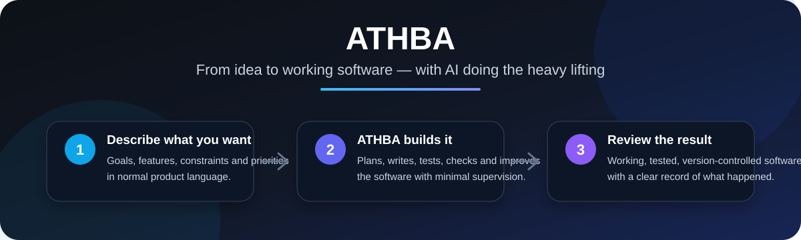

 

### Your autonomous AI software team

**Describe the product you want. ATHBA plans it, builds it, tests it and keeps working until there is something real to review.**

---

## What is ATHBA?

ATHBA is an autonomous software-development platform for turning **product ideas and requirements into working, tested software**.

Instead of giving an AI one huge prompt and hoping the result is right, ATHBA works more like a persistent development team. It breaks the job into manageable pieces, writes and tests the software, checks its own work, keeps a record of what happened and continues from where it left off.

The goal is simple:

> **You should be able to explain what you want built, approve the important decisions, and let ATHBA do the day-to-day software development work.**

ATHBA is being designed to work primarily with **local AI models and local GPU hardware**, with optional use of stronger cloud AI only where it genuinely adds value. That makes long-running autonomous development much more practical and cost-effective.

---

## The experience we are building

<table>
<tr>
<td width="25%" valign="top">

### 💬 1. Describe it

Explain what you want in normal product language. ATHBA helps turn the idea into a clear specification and asks for clarification where needed.

**TBD:** polished conversational project workspace.

</td>
<td width="25%" valign="top">

### 🧭 2. Plan it

ATHBA turns the approved requirements into an achievable development plan and decides what should be built next.

You stay focused on the product rather than managing dozens of AI coding prompts.

</td>
<td width="25%" valign="top">

### 🛠️ 3. Build & test it

ATHBA writes the software in small steps, continuously tests what it builds and protects behaviour that has already been completed.

If work fails, it records why and tries a controlled repair rather than blindly carrying on.

</td>
<td width="25%" valign="top">

### ✅ 4. Review the result

The finished feature is independently checked against the original requirements before it is considered complete.

**TBD:** automatic pull-request / release delivery.

</td>
</tr>
</table>

---

## Why ATHBA?

### 🤖 Autonomous, without being reckless

ATHBA is intended to work for long periods without someone supervising every prompt, while still keeping strong checks around what the AI is allowed to change and what counts as finished.

### 🧪 Testing is part of the build, not an afterthought

The system is built around test-driven development. New behaviour is proven as it is created, and existing behaviour is repeatedly checked as the application grows.

### 🏠 Designed for local AI

A major goal of ATHBA is to make useful autonomous development possible on hardware you control. Small local models are given small, focused jobs rather than being expected to understand an entire application at once.

### 💸 Use expensive AI only where it matters

**TBD:** ATHBA will be able to use inexpensive local AI for routine development and selectively call stronger cloud reasoning for high-value architectural or planning decisions.

### 🔄 Stop, restart and continue

Development state is designed to survive restarts. ATHBA keeps track of what has been completed, what has been proven and what still needs work instead of relying on one long chat session.

### 🔍 A clear trail of what happened

The end product is intended to make autonomous development inspectable: requirements, tests, changes, failures, retries and accepted code should all be traceable.

---

## What ATHBA is aiming to deliver

- **A persistent AI development team** that can work on a software project over hours, days or longer.
- **Natural-language product collaboration** rather than a stream of low-level coding prompts. **TBD**
- **Autonomous feature development** from approved requirements through tested implementation.
- **Local-first execution** using a pool of available AI models and GPUs.
- **Automatic recovery and retry** when a model, test or execution step fails.
- **Independent final checking** against the original product requirements.
- **Git-backed development** with a clear, reviewable history of accepted work.
- **Automatic engineering-quality review and refactoring** once functionality is complete. **TBD**
- **Pull-request and release delivery** into real software repositories. **TBD**
- **Support for multiple programming languages and test frameworks. TBD**
- **A project dashboard showing progress, blockers, evidence and completed work. TBD**
- **Parallel development across multiple ready pieces of work. TBD**
- **Optional cloud reasoning for difficult planning and architecture tasks. TBD**
- **Long-running unattended development campaigns. TBD**

---

## What would using ATHBA look like?

You might start with something as simple as:

> *“I need a small web application for managing home-accessibility assessments. Clinicians should be able to create an assessment, record findings, generate recommendations and produce a report.”*

ATHBA's job is to turn that request into a development project: clarify what is missing, organise the work, build each part, test it, review it and keep progressing until the agreed product behaviour has been delivered.

The user should not need to decide which model should code a particular function, which GPU should run it, how many retries are safe, or whether a failed test should be ignored. Those are implementation details ATHBA and its execution layer are intended to manage.

---

## Built to work with Rack AI

ATHBA focuses on **building the software**. [Rack AI](https://github.com/Tommyboyjedi/rack-ai) focuses on **running the AI workers and managing the available compute**.

Together, the goal is a local AI development environment that can make intelligent use of different GPUs and models without the user having to manually orchestrate them.

**You describe the product** → **ATHBA manages the development** → **Rack AI supplies the compute** → **You review working software**

---

## Who is ATHBA for?

ATHBA is being built for people who want the leverage of an AI development team without giving up control of the product or relying on a single enormous coding model.

It may be particularly useful for:

- solo developers who want an autonomous implementation partner;
- founders and technical product owners turning specifications into software;
- small teams that want AI to take on routine implementation work;
- developers running local AI hardware who want to put that compute to productive use;
- projects where repeatability, testing and auditability matter more than flashy one-shot code generation.

---

## Project status

> **ATHBA is under active development and is not yet a finished product.**

This README describes the **intended end product**. Features marked **TBD** are part of the product vision but are not yet complete.

### Where we are now

The core autonomous-development backend is substantially built and is currently being proven end-to-end against small real software features.

Already implemented or substantially working:

- behaviour-driven development planning;
- autonomous test creation and implementation;
- strict test-driven development loops;
- continuous regression checking;
- independent behaviour review;
- Git-backed development state and restart recovery;
- deterministic safety checks around AI-generated tests and code;
- local model execution through Rack AI;
- automatic model/worker selection based on the kind of work required.

### Current focus

The present work is hardening the final edge cases in the autonomous behavioural-development cycle using a deliberately tiny `SignalBoard` application as the proving ground.

The next milestones are:

1. complete the full `SignalBoard` build and final independent specification check;
2. prove the same process on the larger `ReservationBook` feature;
3. build the post-development engineering-quality and refactoring process;
4. expand from the backend proving system into the polished product experience described above.

---

<strong>Technical documentation</strong>

 

This README is intentionally product-focused. Deeper design and development documentation lives in the repository, including:

- [`docs/ATHBA_RACK_AI_ARCHITECTURE.md`](docs/ATHBA_RACK_AI_ARCHITECTURE.md)
- [`docs/`](docs/)
- active development pull requests and their proving notes

The repository also contains older experimental documentation from earlier versions of ATHBA; active PR documentation reflects the most current architecture where the two differ.

---

### ATHBA

**From an idea to tested software, with an AI team that keeps working.**

Created by **Tom Pearce**

