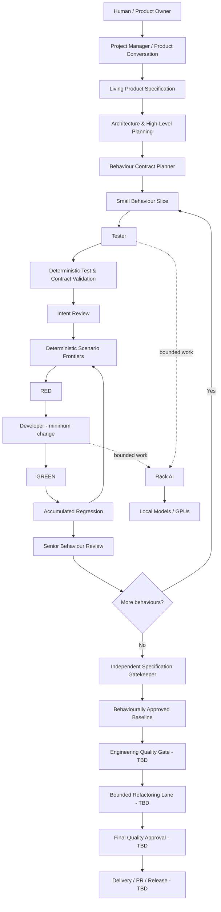

# ATHBA

> **Autonomous software development through specification, strict TDD, bounded AI work and independent verification.**

ATHBA is an AI-assisted software engineering control plane designed to take a product idea from human requirements to tested, reviewable, version-controlled software.

The project is built around a deliberately conservative principle: **AI models propose work; deterministic machinery constrains, verifies and records it.** Rather than asking one large model to build an application in a single pass, ATHBA decomposes development into small behavioural slices and narrow TDD steps that can be executed reliably by comparatively small local models.

> **This README describes the intended end product.** Capabilities marked **TBD** are part of the planned product but are not yet fully implemented or proven end-to-end.

---

## What ATHBA is intended to become

ATHBA is not a coding chatbot and it is not a thin wrapper around an autonomous agent framework. The target product is a persistent software-development system that owns the engineering process around AI workers:

- collaborative specification and product planning;
- architecture and behavioural decomposition;
- strict test-driven implementation;
- independent semantic and deterministic review;
- durable Git-backed state and evidence;
- bounded retries, repair and recovery;
- resource-aware execution through Rack AI;
- final independent specification reconciliation;
- **TBD** post-behavioural engineering-quality and refactoring passes;
- **TBD** higher-level application delivery, remote Git/PR workflows and project reporting.

The intended result is a system that can autonomously develop software for long periods while remaining auditable, restartable and constrained by the specification the user actually approved.

---

## End-to-end product vision



### 1. Human-led product definition

The finished product should begin with a human-facing project conversation rather than a raw coding prompt. A Project Manager role helps refine intent, maintain a living specification, surface decisions and ask for approval where human judgement is genuinely required.

**TBD:** complete conversational product UX, specification editing, project cockpit and rich progress views.

### 2. High-leverage planning

ATHBA turns the approved specification into architecture, behavioural contracts, dependencies and machine-verifiable development work.

High-level reasoning is where larger models provide the most value. The architecture is provider-neutral so that strong cloud reasoning can be used selectively where appropriate without coupling the development engine to one vendor.

**TBD:** production cloud reasoning policy / provider adapter for selected high-level planning and architectural work.

### 3. Small behavioural slices

Large requirements are reduced into deliberately small behaviours. This is fundamental to ATHBA: smaller local models become much more useful when they are never asked to understand or modify more of the system than necessary.

Each worker should receive the **minimum context required for its current job**. Full project knowledge remains in ATHBA's control plane rather than being indiscriminately placed into every model prompt.

### 4. Strict TDD

For each behaviour, ATHBA creates one complete behavioural scenario and deterministically decomposes it into syntactically complete frontiers.

The development loop follows a strict RED/GREEN discipline:

1. expose the next smallest behaviour frontier;
2. prove a legitimate RED or recognise that the frontier is already GREEN;
3. ask the Developer for only enough production code to satisfy that frontier;
4. independently verify GREEN;
5. run accumulated regression;
6. promote only accepted repository state;
7. repeat until the complete behaviour is proven.

The test is progressively materialised; ATHBA does not generate a permanent collection of artificial micro-tests.

### 5. Deterministic guardrails around AI

ATHBA is designed to move work out of model judgement whenever a computer can decide it more reliably.

Current and planned deterministic controls include:

- supported test grammar and syntax;
- repository/path boundaries;
- trusted Git revisions and isolated candidate work;
- exact attempt accounting;
- timeout and failure evidence;
- deterministic regression execution;
- product-surface contract linting;
- prevention of undeclared public APIs and private-state test shortcuts;
- restart-safe persisted state;
- machine-enforced worker capability and workspace limits through Rack AI;
- **TBD:** additional language adapters and contract-aware static checks.

### 6. Independent reviews with different responsibilities

ATHBA intentionally separates review responsibilities rather than using one model as a universal judge.

- **Intent Review** asks whether the proposed test is genuinely trying to demonstrate the active behaviour.
- **Senior Behaviour Review** checks the completed individual behaviour after the TDD cycle.
- **Specification Gatekeeper** is an independent final audit of the complete behavioural delivery. It must verify both that required behaviour is present **and that unintended behaviour has not crept into the product**.

The Gatekeeper is deliberately separate from the development feedback loop so that development cannot use the final examiner's checklist to teach itself how to pass the exam.

### 7. Engineering-quality and refactoring lane — **TBD**

Behavioural correctness and engineering quality are deliberately separate concerns.

After the complete implementation has passed the independent Specification Gatekeeper, ATHBA is intended to establish a frozen behavioural baseline and then run a separate local-only engineering-quality process:

```text
Behaviourally approved baseline
    -> Engineering Quality Gate
    -> bounded refactoring work
    -> full accepted regression suite
    -> Refactor Reviewer
    -> Engineering Quality Gate
    -> quality-approved revision
```

Accepted behavioural tests remain the authority during refactoring. Refactoring may improve structure, cohesion, duplication, naming and implementation shape, but it must not silently change observable product behaviour.

### 8. Delivery and ongoing project operation — **TBD**

The end product should retain a durable history of specification decisions, architecture, work decomposition, test evidence, model executions, accepted revisions and final delivery state.

Planned product-level capabilities include:

- remote repository onboarding and bounded workspace registration;
- Git branch / pull-request delivery;
- human-readable progress beneath high-level project tickets;
- dependency-aware parallel ready-work pools;
- project memory and repository intelligence;
- failure/replan history and evidence drill-down;
- engineering metrics such as first-pass success, retries, work-unit size and time-to-green;
- resumable unattended campaigns;
- multi-project operation and scheduling.

---

## ATHBA and Rack AI

ATHBA and Rack AI are intentionally separate products with a narrow interface.

### ATHBA owns software engineering

ATHBA understands:

- specifications and architecture;
- behaviours and dependencies;
- Tester / Developer / Reviewer roles;
- strict TDD progression;
- semantic repair and acceptance;
- canonical repository state;
- specification reconciliation;
- software-level progress and failure decisions.

### Rack AI owns execution and resources

Rack AI understands:

- model capability and qualification;
- GPU / worker availability;
- local model and runtime lifecycle;
- bounded workspace execution;
- path and execution limits;
- worker selection;
- resource scheduling;
- execution provenance and evidence.

ATHBA asks for a **generic capability**, not a named GPU or model. Rack AI selects the least-scarce qualified execution resource and returns durable evidence of what actually ran.

```text
ATHBA
  "I need a small coding task executed against this exact revision"
        |
        v
Rack AI
  "This qualified worker/model/GPU can execute it safely"
        |
        v
Bounded workspace -> evidence -> candidate revision
        |
        v
ATHBA interprets the result as software-engineering progress
```

This boundary allows ATHBA's engineering process to evolve independently from the hardware, models and execution runtime beneath it.

---

## Local-first AI strategy

ATHBA is being designed around the capabilities of a real local GPU rack rather than assuming unlimited frontier-model inference.

The core development philosophy is:

> **Make the job small enough that the model can succeed, then make the surrounding system strong enough that a model mistake cannot silently become truth.**

Current design direction:

- high-level specification / architectural reasoning may selectively use stronger external reasoning where it provides clear value — **TBD**;
- behavioural planning downward is designed to operate locally;
- Tester and Developer roles receive deliberately narrow context;
- deterministic validation catches structural and contract violations before semantic reviewers are used;
- Rack AI selects qualified local workers based on capability and complexity;
- **TBD:** the post-Gatekeeper refactoring process is also intended to remain local-only.

---

## Design principles

### Model output is a proposal, not authority

Prompts are advisory. Typed execution envelopes, deterministic policy and accepted evidence are authoritative.

### Prefer proof over confidence

A model saying that work is correct is weaker evidence than a reproducible test, regression result, Git revision and independently captured execution record.

### Keep context small

Workers should see only what they need. ATHBA can retain a much larger private control-plane view and use it for deterministic constraints without leaking future functionality into a small task.

### Fail closed

Unsupported syntax, stale state, ambiguous execution, unqualified workers, undeclared product surface and invalid evidence should stop progression rather than being guessed through.

### Preserve independent checks

Planning, implementation, behavioural review, specification reconciliation and engineering-quality review have different purposes. They should not collapse into one self-approving model loop.

### Git is part of the state machine

Accepted revisions, candidate branches, trusted bases and evidence are first-class parts of autonomous development. Restarting ATHBA should not change what has or has not been proven.

---

## Target capability map

| Capability | End-state intent | Status |
|---|---|---|
| Human project conversation | Shape and refine a live product specification | **TBD** — legacy PM/chat foundation exists; end-state UX not complete |
| Living specification | Durable approved source of product intent | Partial |
| Architecture & decomposition | Turn product intent into bounded behaviours and dependencies | Partial / active development |
| Behaviour Contract | Typed behavioural work plan with source traceability | Implemented in active development stack |
| Minimal-context Tester | Author one complete scenario for one behaviour | Implemented in active development stack |
| Deterministic scenario validation | Syntax, grammar, production references, anti-evasion checks | Implemented |
| Behaviour Contract product-surface lint | Block undeclared/private product interaction without leaking future API | Implemented and live-proven |
| Observation support for otherwise unobservable slices | Reveal only the minimum legitimate witness interface when required | **TBD — active development** |
| Intent Review | Independent fuzzy check that a test demonstrates the intended behaviour | Implemented |
| Deterministic frontier decomposition | Grow one complete scenario through semantic frontiers | Implemented |
| Strict RED/GREEN execution | Minimum implementation per frontier with evidence | Implemented |
| Accumulated regression | Re-run accepted behaviour before promotion | Implemented |
| Senior Behaviour Review | Review one completed behaviour before completion | Implemented |
| Trusted revision lifecycle | Promote only accepted Git state and recover safely | Implemented / being live-proven |
| Restart/resume | Continue campaigns from persisted state without losing safety decisions | Implemented; broader end-to-end proof ongoing |
| Independent Specification Gatekeeper | Final audit for missing and unwanted behaviour | Foundation implemented; full live proof pending |
| Rack AI capability routing | Generic capability/complexity request with qualified worker selection | Implemented and qualified |
| Local autonomous development | Behaviour planning, testing, coding and review on local models | Active end-to-end proving |
| Multi-language strict-TDD adapters | Python plus additional language-specific deterministic adapters | Python/pytest active; **TBD** for additional languages |
| Cloud high-level reasoning gateway | Optional strong reasoning for selected high-leverage planning | **TBD** |
| Engineering Quality Gate | Static/semantic engineering-quality findings after behavioural approval | **TBD** |
| Bounded refactoring lane | Improve structure while frozen tests preserve behaviour | **TBD** |
| Remote Git / PR delivery | Produce reviewable application PRs/releases | **TBD** |
| Project cockpit / metrics | Human-readable status, evidence and performance metrics | **TBD** |
| Parallel project/work scheduling | Run multiple ready work items while Rack AI owns resources | **TBD** |

---

## Current development stack

The current proving environment uses ATHBA together with [Rack AI](https://github.com/Tommyboyjedi/rack-ai) as the local execution backend.

The active architecture uses:

- Python / Django application and domain services;
- durable repository-backed development state;
- Git revisions and isolated workspaces as execution boundaries;
- provider-neutral reasoning interfaces;
- Rack AI bounded work-unit execution;
- JCode-backed local coding workers;
- vLLM-backed local model endpoints;
- Python/pytest as the first strict-TDD language adapter.

The historical repository also contains earlier UI, agent and LLM-service experiments. Some of those remain useful foundations, but they should not be read as the final architecture where this README differs from older documentation.

---

## Progress summary

**Current focus:** proving the complete autonomous behavioural-development path end-to-end before moving on to post-behavioural refactoring and larger application builds.

### Proven / substantially implemented

- ATHBA ↔ Rack AI ownership boundary and generic bounded workspace execution.
- Capability/complexity-based local worker selection with durable execution provenance.
- Typed Behavior Contracts with immutable source-requirement evidence.
- Minimal-context scenario authoring with deterministic Python/pytest validation.
- Independent Intent Review with bounded structured-response handling.
- Deterministic decomposition of one complete scenario into strict-TDD frontiers.
- Valid RED classification, minimum Developer work, GREEN verification and accumulated regression.
- Canonical Git revision progression and persisted campaign state.
- Senior behaviour review and bounded repair paths.
- Deterministic Behavior Contract product-surface lint for both tests and production candidates.
- Restart-safe enforcement of static candidate rejection.
- Live proof that undeclared product surface is blocked before Intent Review or Developer execution.

### Active proving / hardening

- **PR29** is the current strict-TDD proving branch.
- The tiny `SignalBoard` fixture has progressed through real behaviour planning, scenario authoring, deterministic lint, Intent Review, TDD frontiers, coding, GREEN regression and Senior Review.
- The current blocker is a confirmed **behaviour-slice observability gap**: a deliberately minimal Tester sometimes needs a legitimate observation interface that belongs elsewhere in the private Behavior Contract, without being shown the rest of that future behaviour.
- **TBD / in active development:** just-in-time observation support that preserves minimal worker context while allowing a valid declared witness interface to be used.
- After SignalBoard completes, the next proving target is a larger fresh `ReservationBook` feature.

### Deliberately deferred

- **TBD:** Engineering Quality Gate and autonomous refactoring lane (documented future work in PR21).
- **TBD:** production high-level cloud reasoning policy.
- **TBD:** additional language adapters beyond Python/pytest.
- **TBD:** complete human-facing project cockpit and specification UX.
- **TBD:** remote PR/release delivery and multi-project autonomous operation.

The immediate milestone is simple to state even if it is difficult to achieve: **ATHBA should be able to take an unchanged behavioural specification, build every behaviour through strict TDD using the local rack, survive restart, and pass an independent final Specification Gatekeeper without external supervision.**

---

## Repository documentation

The repository contains both historical documentation and newer architecture/proving material. Useful starting points include:

- [`docs/ATHBA_RACK_AI_ARCHITECTURE.md`](docs/ATHBA_RACK_AI_ARCHITECTURE.md) — ATHBA / Rack AI ownership and execution boundary.
- [`docs/SETUP.md`](docs/SETUP.md) — repository setup material.
- [`docs/`](docs/) — architecture, development and historical phase documentation.
- Active PR documentation — the most current strict-TDD and proving decisions currently live on the active development PRs before they are merged into the default branch.

---

## Project status

ATHBA is an active research and development project. It is **not yet a finished autonomous software-development product**. The architecture is intentionally being proven incrementally with real local models and real Git-backed builds before larger application development is entrusted to it.

## License

Proprietary.

## Author

Tom Pearce
