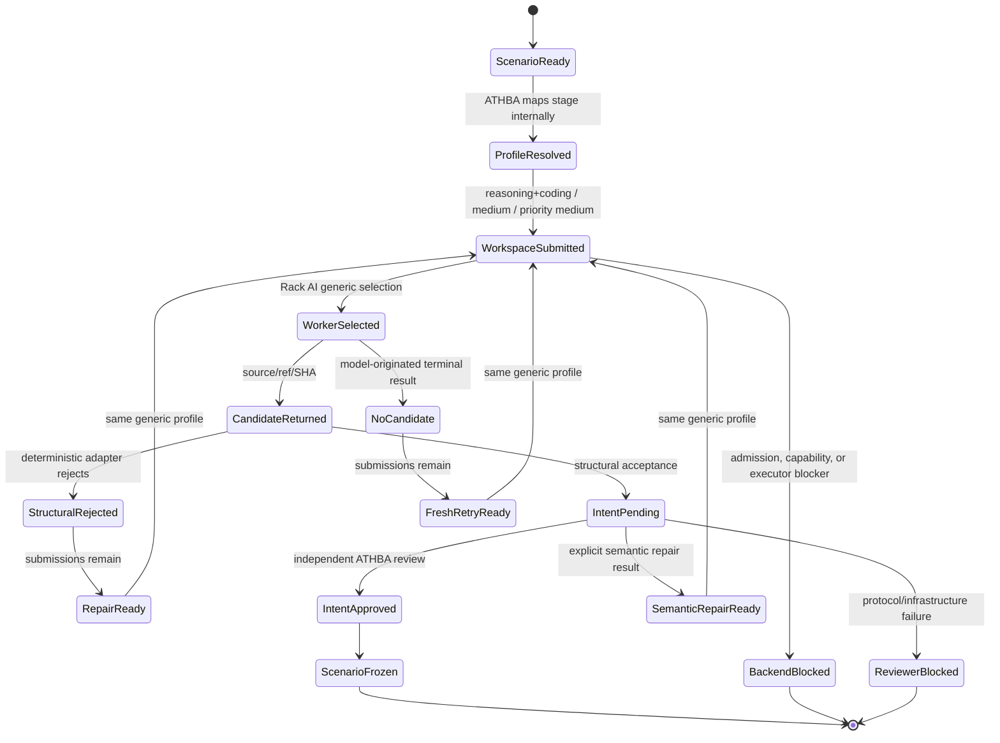
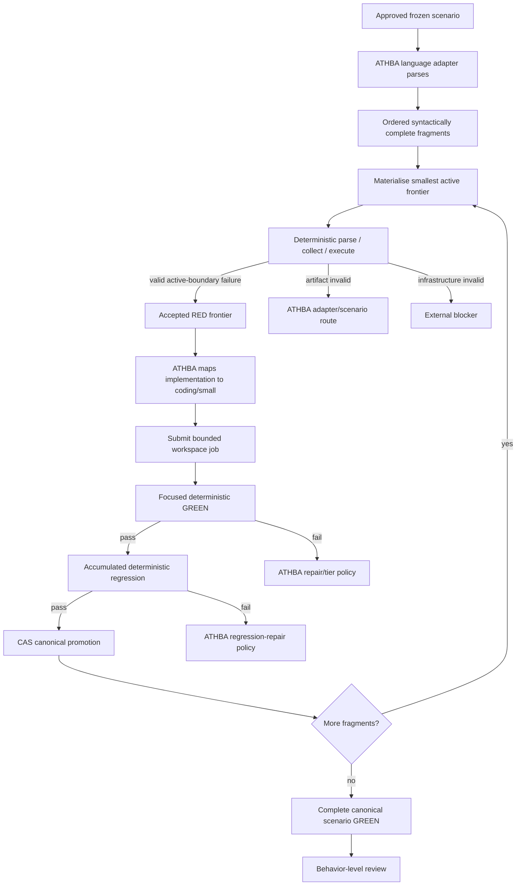
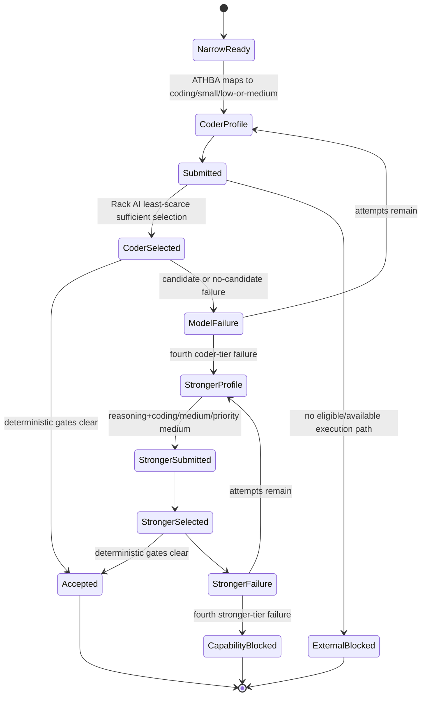
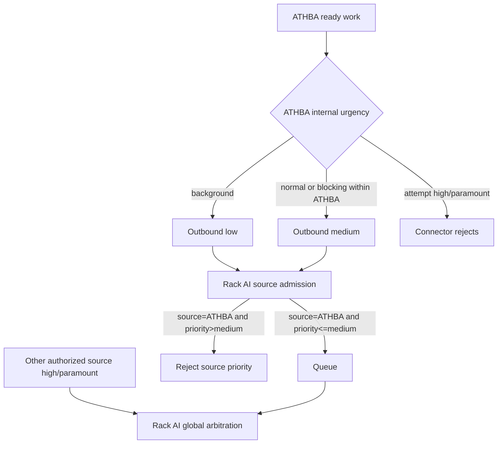
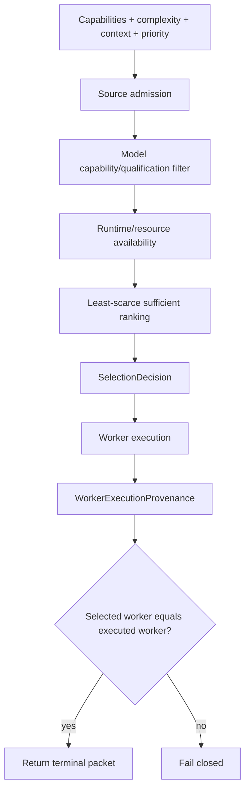
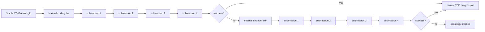
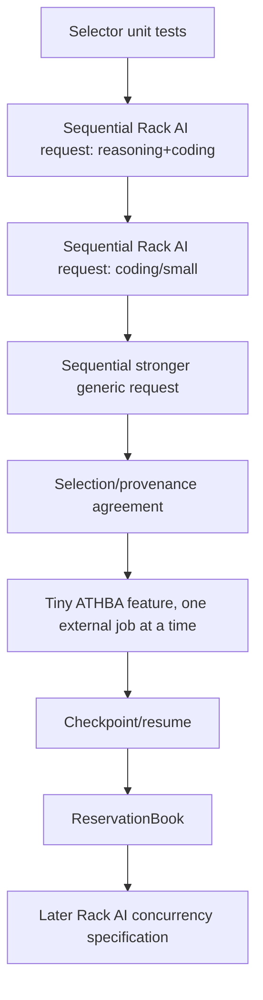
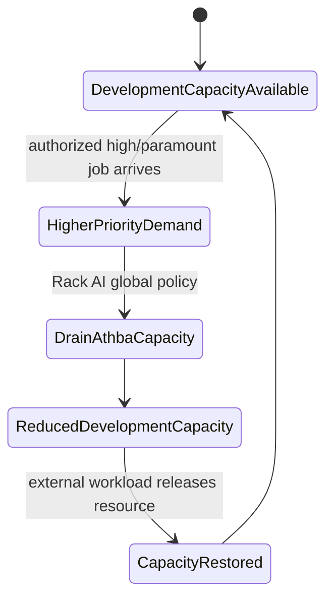

# PR23 Generic Workspace Routing State Machines

## Status

Documentation-only companion to the routing architecture.

ATHBA stage names remain inside ATHBA. Rack AI sees only generic workspace jobs with capability, complexity, context, low/medium ATHBA priority, opaque identity, and bounded execution constraints.

## Complete scenario authoring



Rack AI never receives `ScenarioReady`, `RepairReady`, or intent terminology.

## Deterministic frontier progression



No model creates intermediate tests.

## Coding-first implementation and stronger route



Rack AI sees only the generic profile change. ATHBA owns why it changed.

## ATHBA ledger to Rack AI queue

```mermaid
sequenceDiagram
    participant A as ATHBA semantic ledger
    participant C as RackAiWorkspaceConnector
    participant R as Rack AI generic queue
    participant S as Rack AI selector
    participant W as Selected worker
    A->>A: resolve dependencies/readiness
    A->>A: choose dispatchable ready work
    A->>C: internal work + generic profile
    C->>C: enforce ATHBA priority <= medium
    C->>R: opaque bounded workspace request
    R->>R: source admission; reject ATHBA high/paramount
    R-->>C: durable acknowledgement
    R->>S: capability/context/complexity/resource selection
    S-->>R: generic selection decision
    R->>W: bounded workspace execution
    W-->>R: terminal execution evidence
    R-->>C: result + selection + provenance
    C-->>A: backend-neutral result
    A->>A: interpret using development semantics
```

There is no shared dependency pool.

## Priority boundary



High/paramount remain available to Rack AI for other authorized workloads and future resource-drain policy.

## Selection and execution provenance



## Per-tier attempt accounting



Tier meaning does not cross the connector.

## Sequential proof gate



No concurrency optimization is needed before `H`.

## Future resource withdrawal



ATHBA continues to submit low/medium jobs and sees generic queued/running/terminal states. It never identifies the GPU being withdrawn.

## Resume invariants

Persisted ATHBA state retains:

- stable work identity;
- internal stage/tier;
- submissions consumed;
- candidate/no-candidate history;
- base ref/SHA and allowed paths;
- connector submission IDs;
- terminal results;
- canonical revision and transition receipts.

Rack AI persists:

- opaque request;
- source and accepted priority;
- selection decision;
- lease/execution state;
- execution provenance;
- terminal packet.

Completed submissions, frontiers, and promotions are never repeated after restart.