# PR23 ATHBA Routing and Generic Connector State Machines

## Status

Documentation-only companion to `pr23_worker_capability_routing_architecture.md`.

The diagrams distinguish:

- ATHBA's internal software-development state;
- ATHBA's generic execution-profile mapping;
- the replaceable connector boundary;
- Rack AI's generic queue and resource selection.

Rack AI does not receive ATHBA software-engineering work kinds.

## End-to-end boundary

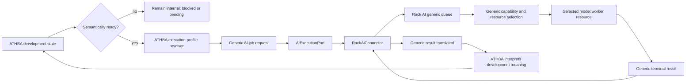

The software-development stage never crosses the connector boundary.

## ATHBA internal work ledger

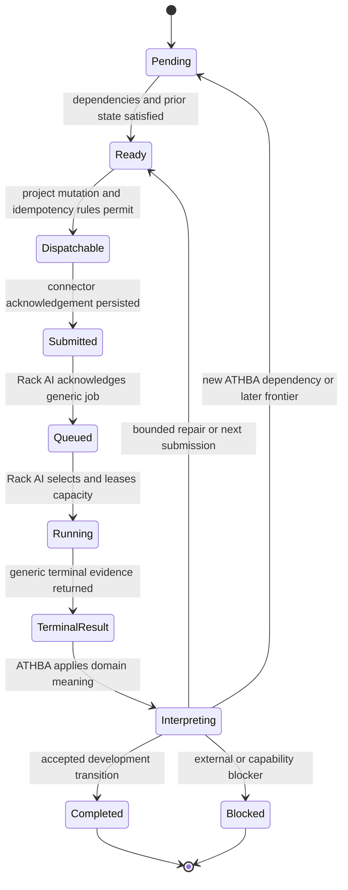

ATHBA may submit every item that is both semantically ready and dispatchable. It does not share its dependency graph or mutable semantic state with Rack AI.

## Rack AI generic queue

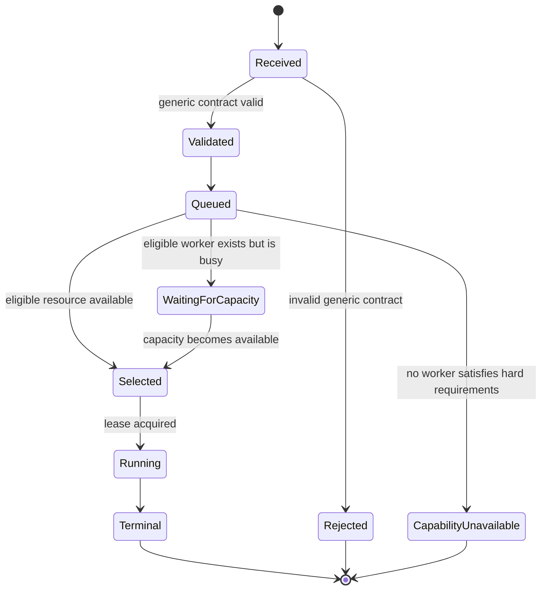

Rack AI understands only generic capability, complexity, context, priority, execution form, constraints, and opaque identity.

## Complete scenario authoring inside ATHBA

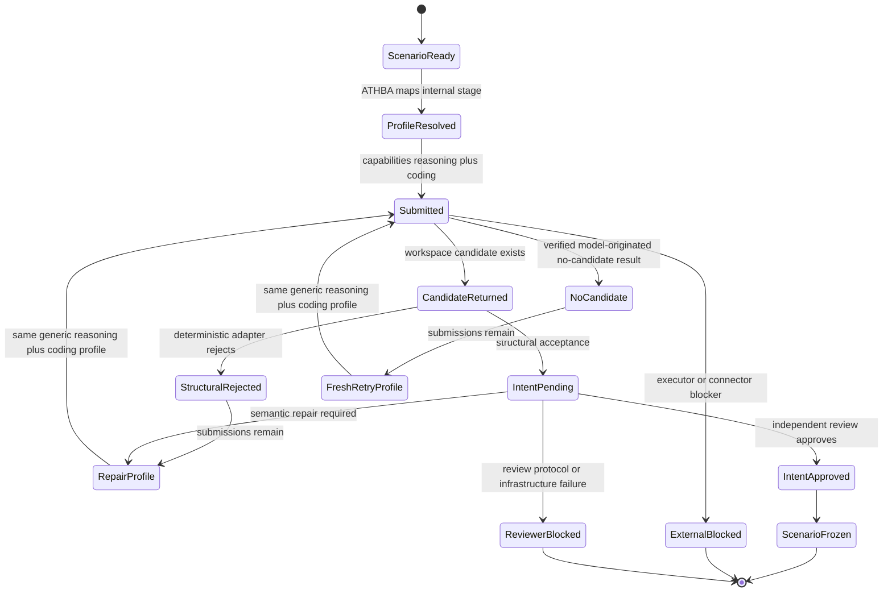

Rack AI sees a generic `[reasoning, coding]` workspace job. It does not know it is authoring or repairing a scenario.

## Deterministic frontier progression

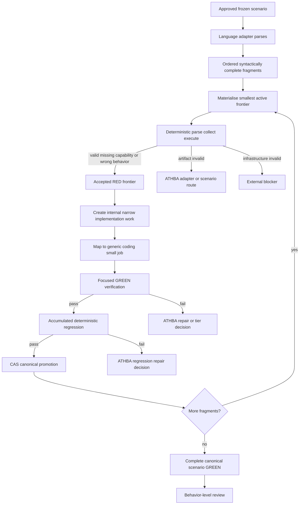

No model creates intermediate fragment tests.

## Narrow implementation and stronger fallback

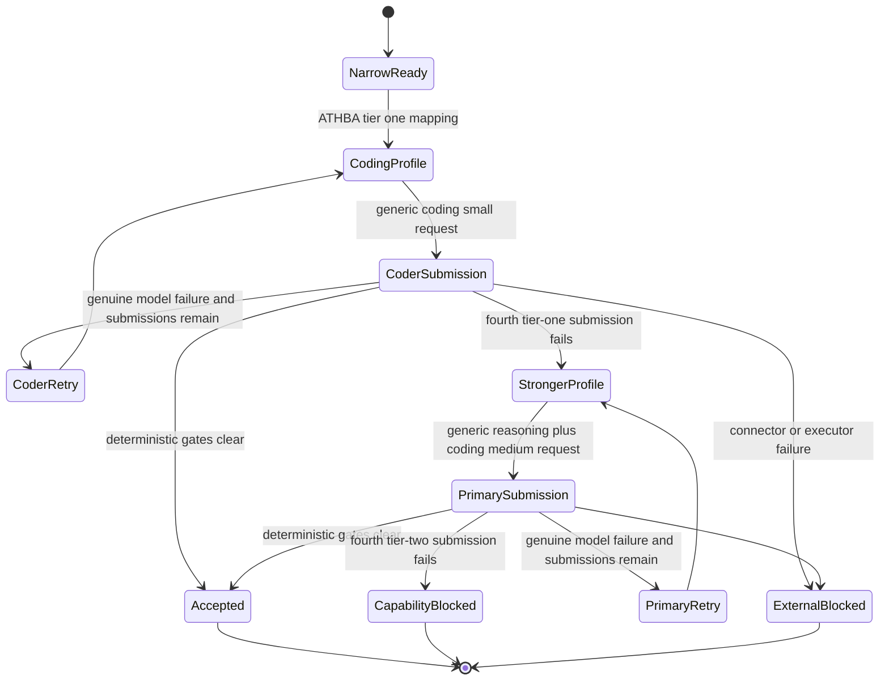

Rack AI sees only the generic profile attached to each submission. ATHBA owns why the profile changed.

## Per-tier identities

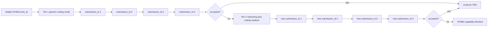

`work_id` is opaque to Rack AI. Every actual invocation has a unique `submission_id` and execution/change identity.

## Capability filtering without software semantics

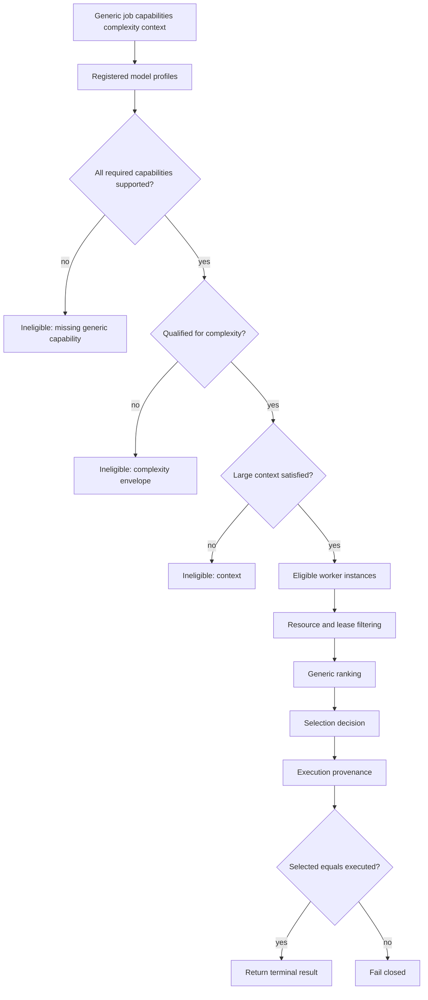

## Priority is independent of capability

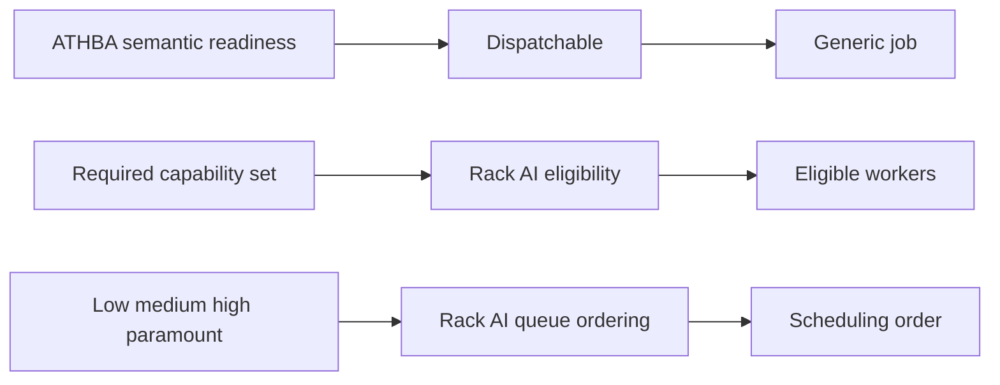

A high-priority coding-only job does not become a reasoning job. A low-priority reasoning job remains reasoning work.

## No shared pool and no dependency leakage

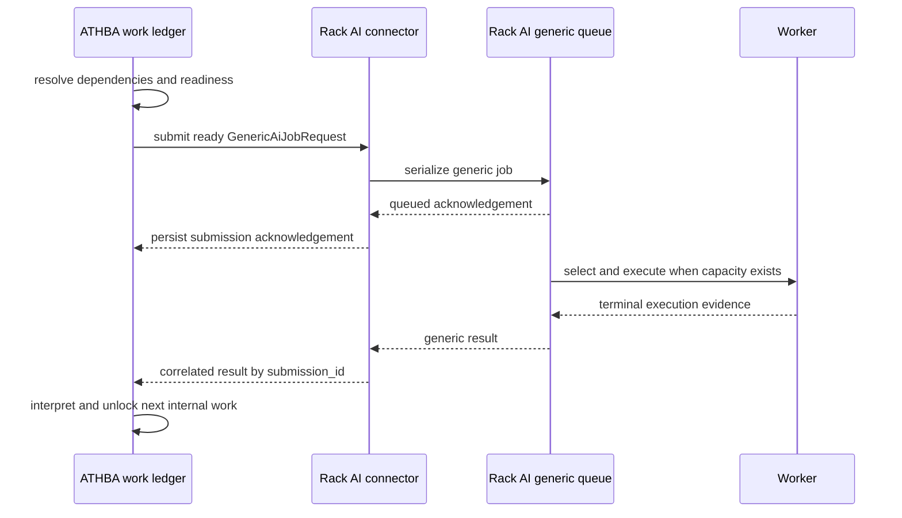

Rack AI receives no behavior graph and no instruction that job A must precede job B. ATHBA simply does not submit B until B is ready.

## Replaceable connector

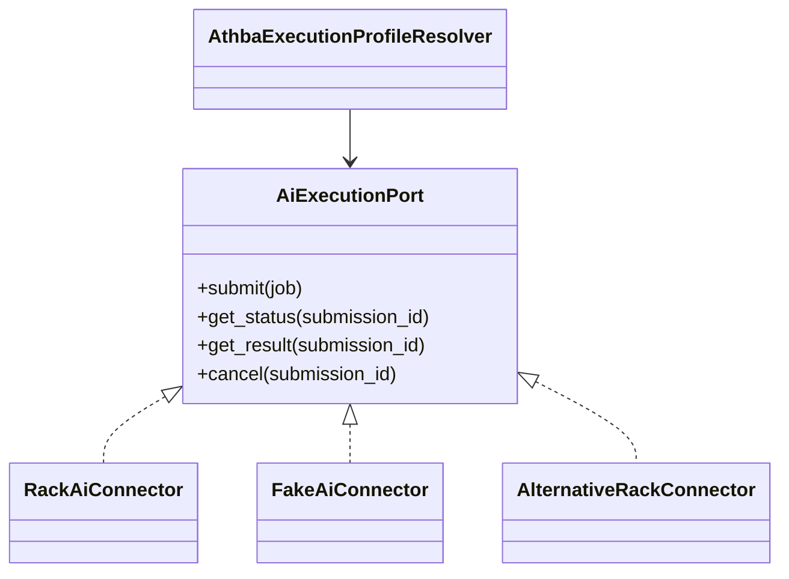

ATHBA domain services depend on the port, not Rack AI's transport schema.

## Sequential routing proof

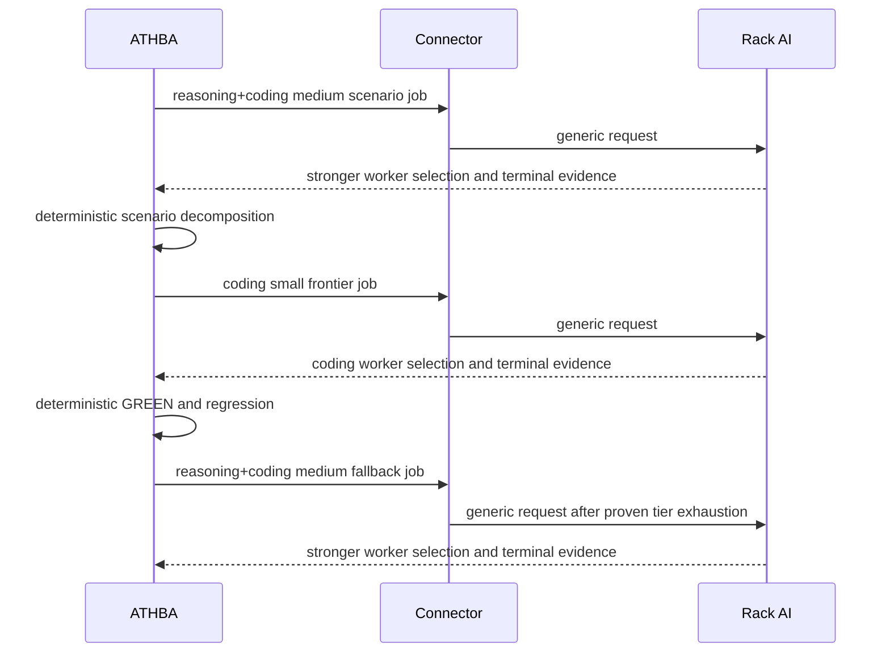

This sequential proof is required before any concurrent GPU scheduling test.

## Same model on two GPUs and competing workload

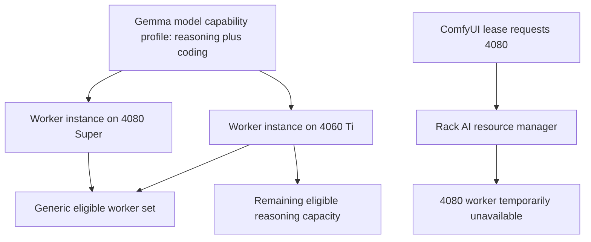

The detailed lease/scheduler policy is deferred to a separate Rack AI specification. ATHBA's generic job does not change when one worker disappears.

## Resume invariants

Persisted ATHBA state retains:

- internal work identity and development stage;
- generic execution profile used for each submission;
- tier and submissions consumed;
- candidate and no-candidate lineage;
- base ref/SHA and allowed paths;
- connector submission acknowledgement;
- Rack AI selection evidence and execution provenance;
- pending transition receipt;
- canonical revision.

Persisted Rack AI state retains:

- generic request and idempotency key;
- queue/execution status;
- selected worker/resource decision;
- lease evidence;
- terminal packet.

A completed submission, transition, or promotion must not be repeated after restart.
