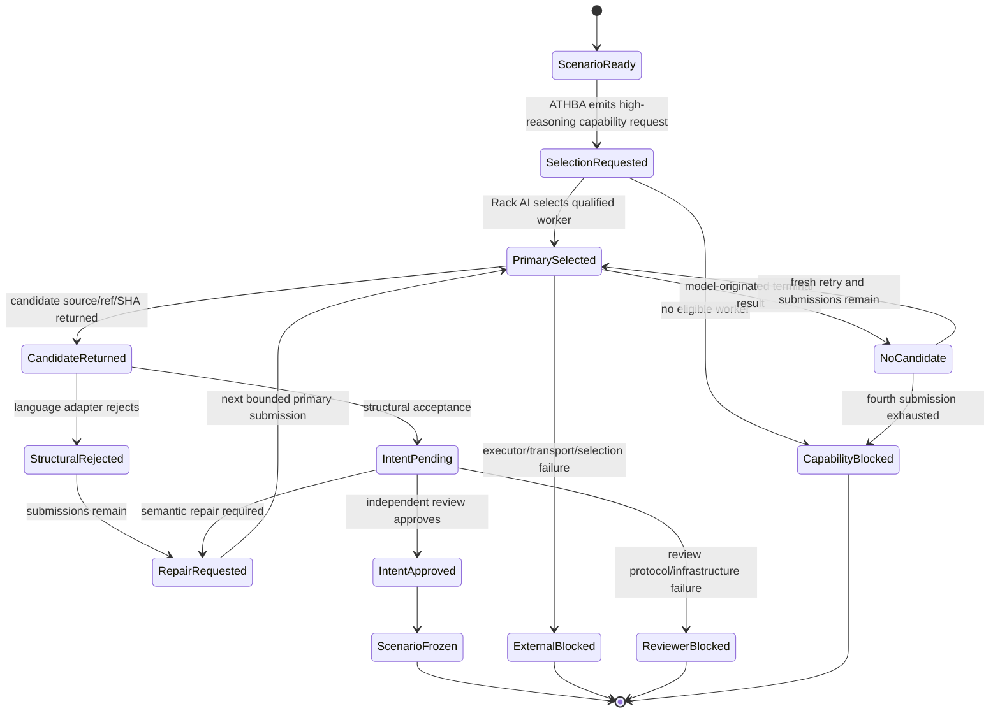
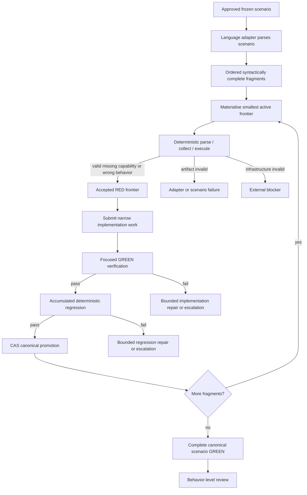
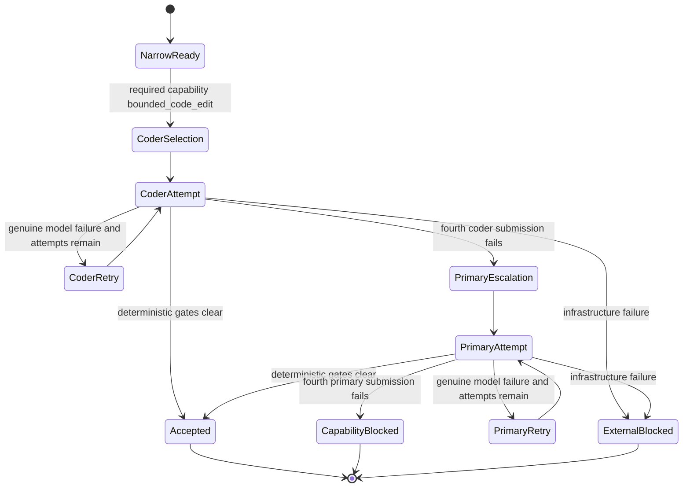
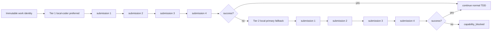
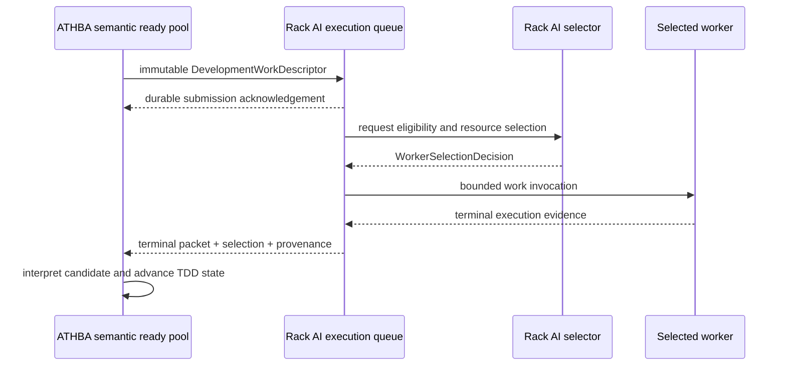
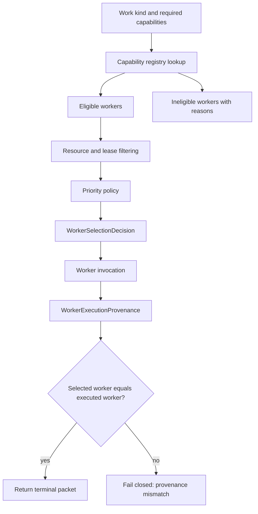
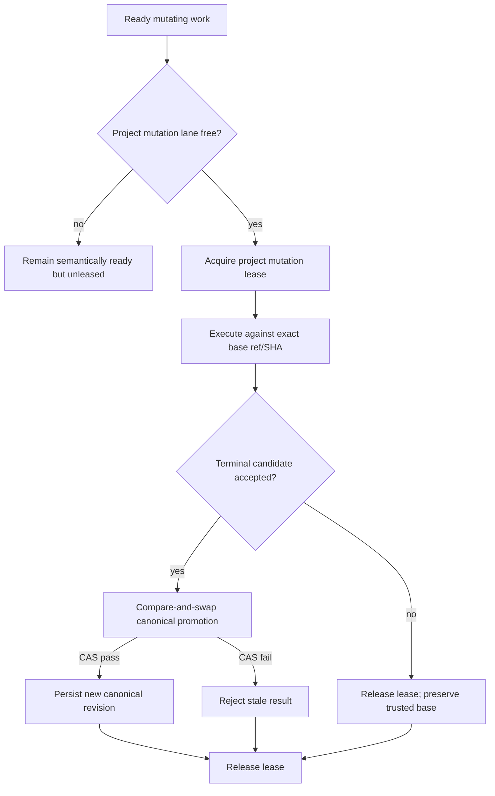

# PR23 Worker-Routing State Machines

## Status

Documentation-only companion to `pr23_worker_capability_routing_architecture.md`.

## Complete scenario authoring

Scenario authoring uses one high-reasoning tier with at most four actual model submissions. Infrastructure failures do not consume the model budget.

## Deterministic frontier progression

No model creates intermediate fragment tests. The same canonical test evolves through history.

## Narrow implementation and escalation

There is no transition from the primary fallback tier back to the coder tier.

## Per-tier attempt accounting

Every actual invocation has a unique submission and change identity. Process restart cannot reset either tier.

## ATHBA ready pool to Rack AI execution queue

ATHBA alone decides semantic readiness. Rack AI alone decides concrete worker/resource availability.

## Worker selection and execution provenance

Selection evidence explains **why** a worker was selected. Execution provenance proves **what** ran.

## Idle-primary overflow

```mermaid
stateDiagram-v2
    [*] --> PrimaryIdle
    PrimaryIdle --> HighReasoningLease: high-reasoning work ready
    PrimaryIdle --> EscalatedLease: no high-reasoning work; escalated narrow work ready
    PrimaryIdle --> OverflowLease: no high-reasoning or escalated work; overflow eligible
    OverflowLease --> OverflowRunning
    OverflowRunning --> PrimaryIdle: bounded task finishes
    HighReasoningLease --> HighReasoningRunning
    HighReasoningRunning --> PrimaryIdle: task finishes
    EscalatedLease --> EscalatedRunning
    EscalatedRunning --> PrimaryIdle: task finishes
```

Version 1 is non-preemptive. If high-reasoning work arrives during a bounded overflow task, the running task finishes, but no additional overflow lease is issued.

## Project mutation lock

One active mutating lane per project is the version-1 rule. Independent projects may execute concurrently.

## Failure ownership matrix

| Event | Consumes model submission? | Primary owner | Next action |
| --- | --- | --- | --- |
| Structurally invalid candidate | Yes | ATHBA | repair within current tier |
| Semantic repair disposition | Yes | ATHBA | repair within current tier |
| Model uses unadvertised tool / no candidate | Yes | ATHBA using Rack AI evidence | fresh retry within current tier |
| Worker timeout after verified invocation | Yes | Rack AI evidence + ATHBA tier policy | next bounded submission or escalation |
| Worker not selected | No | Rack AI | external/capability blocker |
| Executor/transport/worktree failure | No | Rack AI | external blocker |
| No eligible worker | No | Rack AI selection | capability blocker |
| Malformed terminal packet/provenance mismatch | No | cross-boundary contract | fail closed |
| Focused GREEN failure | Yes | ATHBA | repair current tier |
| Deterministic regression failure | Yes when repair model invoked | ATHBA | bounded repair / escalation |
| Four coder submissions fail | N/A | ATHBA | authorize primary tier |
| Four primary submissions fail | N/A | ATHBA | capability-blocked terminal state |

## Resume invariants

Persisted state must retain:

- immutable work ID;
- current tier;
- submissions consumed within each tier;
- global submission sequence;
- last selected worker decision;
- actual execution provenance;
- candidate and no-candidate history;
- repair and escalation parents;
- base ref/SHA and allowed paths;
- pending transition receipt;
- canonical revision and project mutation lease state.

A completed frontier, model submission, selection decision, or promotion must not be repeated after restart.
